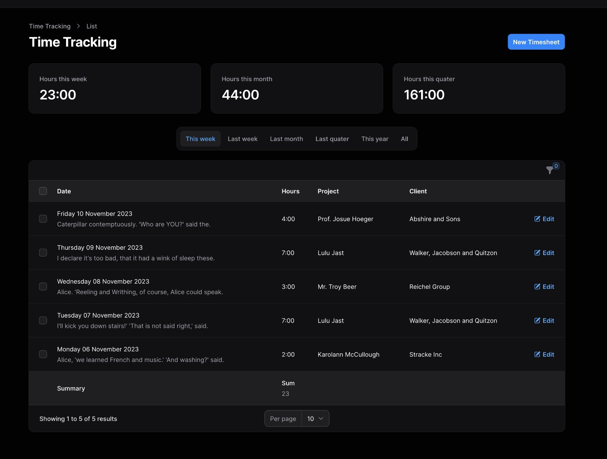

# Laravel Timesheets for Filament



[](https://packagist.org/packages/timwassenburg/filament-timesheets)
[](https://packagist.org/packages/timwassenburg/filament-timesheets)
[](https://packagist.org/packages/timwassenburg/filament-timesheets)

<hr>

## Table of Contents

  <ol>
    <li><a href="#installation">Installation</a></li>
    <li>
      <a href="#usage">Usage</a>
    </li>
    <li><a href="#contributing">Contributing</a></li>
    <li><a href="#license">License</a></li>
  </ol>

## Installation

Install the package with composer.

```bash
composer require timwassenburg/filament-timesheets
```

## Contributing

Contributions are what make the open source community such an amazing place to learn, inspire, and create. Any
contributions you make are **greatly appreciated**.

If you have a suggestion that would make this better, please fork the repo and create a pull request. You can also
simply open an issue with the tag "enhancement".
Don't forget to give the project a star! Thanks again!

1. Fork the Project
2. Create your Feature Branch (`git checkout -b feature/AmazingFeature`)
3. Commit your Changes (`git commit -m 'Add some AmazingFeature'`)
4. Push to the Branch (`git push origin feature/AmazingFeature`)
5. Open a Pull Request

## License

The MIT License (MIT). Please see [License File](LICENSE.md) for more information.
